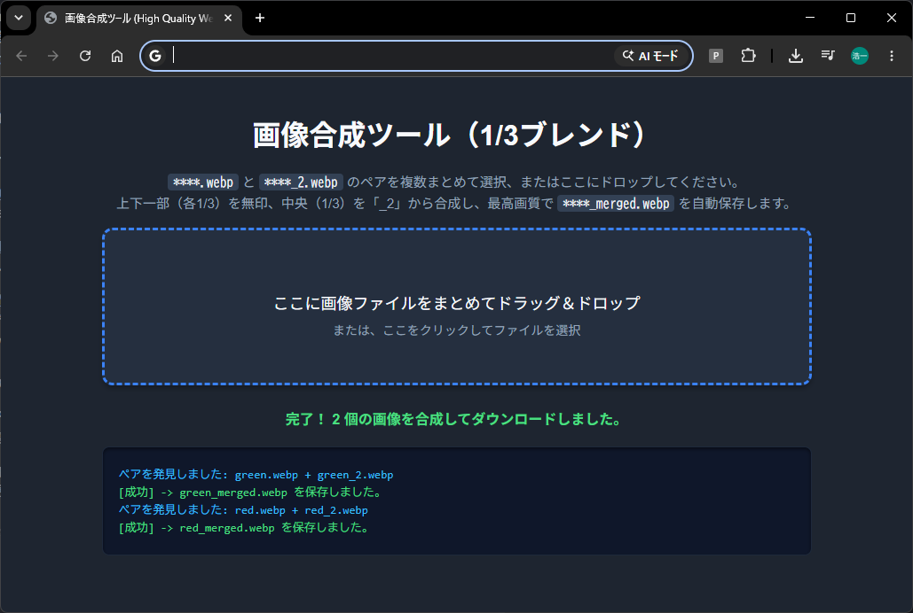
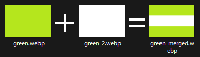
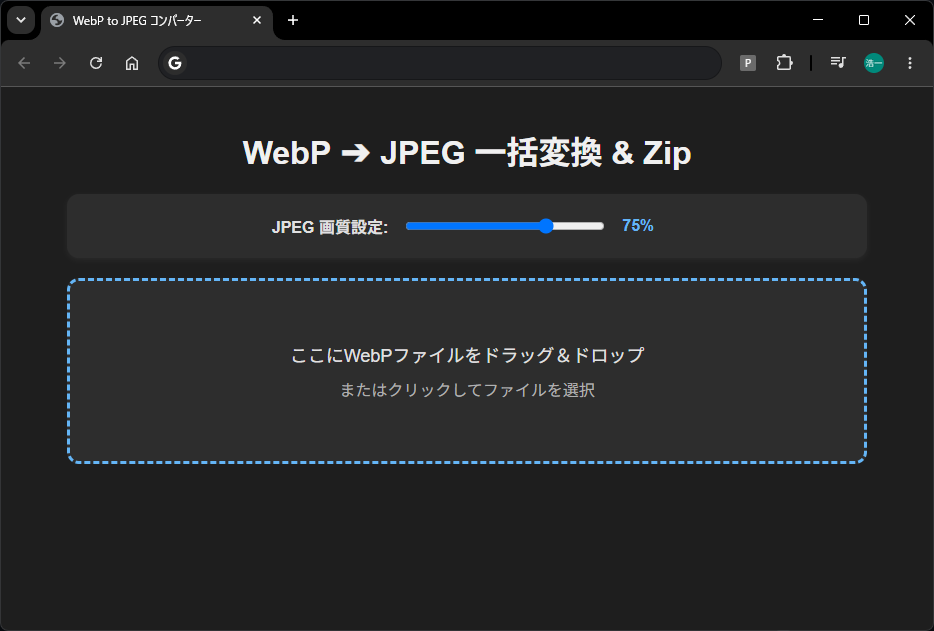
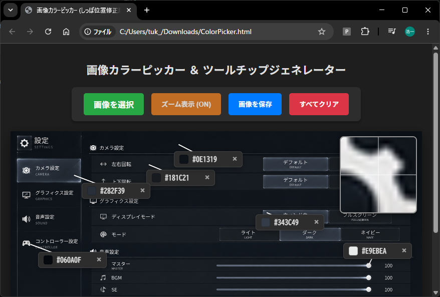

# ごちゃごちゃパック

## リンク

### 生活系

- [ImageDiff](#imagediff)  
  ２～４枚の画像を比較表示
- [OneThirdBlender](#onethirdblender)  
  1/3ブレンダー
- [WebPtoJpegConverter](#webptojpegconverter)  
  WebpをJpegに一括変換

### 制作系

- [ColorPicker]()  
  色確認ツール

## ImageDiff

２～４枚の画像を比較表示する。拡縮・移動可能。  
Studi○Aliceで見かける感じのやつ。

[ImageDiff](imagediff.html)

## OneThirdBlender

1/3ブレンダー。  
****.webp と ****_2.webp を合成して1枚の画像を作る。  
国旗とか作る時に使えるのかも？

[OneThirdBlender](onethirdblender.html)

用意する画像：  

## WebPtoJpegConverter

ドラッグアンドドロップされたWebpファイルをJpeg化してZIPにします。  
ローカル環境で動作します。

[WebPtoJpegConverter](webp2jpg.html)

## ColorPicker

指定位置の色を表示するツール。

[ColorPicker](ColorPicker.html)

